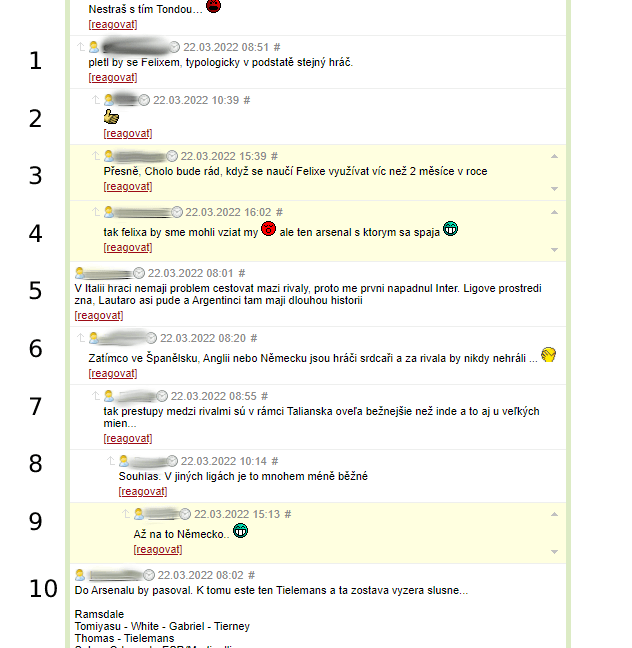

# EF Better Comments - Extension for Google Chrome

## _Slick hotkeys for comment section at site Eurofotbal.cz_ ⚽

Under popular articles there can be over a thousand comments. This plugin seeks to improve the user experience by making it much faster and easier to navigate between comments. It has a variety of navigation options, like scrolling solely between new comments, or jump to the parent comment and much more. (Note that some functions are only available to logged-in users on the site.)



###### Eurofotbal.cz's typical discussion structure (old comments white, colored comments new; only logged user)

### Keys Q, A

- Simple moving up or down between comments by one comment at the time.

```sh
✨ From comment number 5, you will scroll to number four or six.
```

### Keys W, S

- Jump five comments up or down at a time.

```sh
✨ From comment number 5, you will scroll to number zero or ten.
```

### Keys E, D (only available to logged-in users)

- Easily scrolling up and down through new comments only.

```sh
✨ You will scroll between numbers three, four, and nine.
```

### Keys R, F

- The parent comment will be found by using R key.
- F will skip back to the original comment.

```sh
✨ From comments 2, 3, and 4, you will come to number two.
The F key will take you back to the original comment where you were when you jumped to the parent.
```

### Key Digit2

_(Digit2 above letters; not num2 from a numeral part of a keyboard.)_

- Digit2 will scroll to the article headline

```sh
✨ Its pretty self-explanatory.
```

### Key X (only available to logged-in users)

- Scroll to the comment box at the bottom of the page and start writing a new comment.

### How to install an unpacked Chrome Extension

You can download this extension on [release page](https://github.com/Canario5/EfJumpComments/releases). Then unpack downloaded .zip archive and load extension manually into Chrome browser. The best way is to follow the official [guide](https://developer.chrome.com/docs/extensions/mv3/getstarted/#unpacked) from Google.

### Feedback from our users:

> `Bez tohoto rozšíření si diskuzi o Gambrinus lize už ani nedovedu představit.` _T. G. Masaryk_

> `Naozaj múdry systém komentárov.` _Hudynho_

> `Attention. My Dear:`  
> `Please reconfirm to me your full delivery address,`  
> `And your nearest airport to land, on this information below so that i`  
> `can deliver your Package worth $7.5 Million Dollar`  
> _Diplomat From Internationl Monetary Fund_  
> _Mr. Adedayo Olubunmi_
